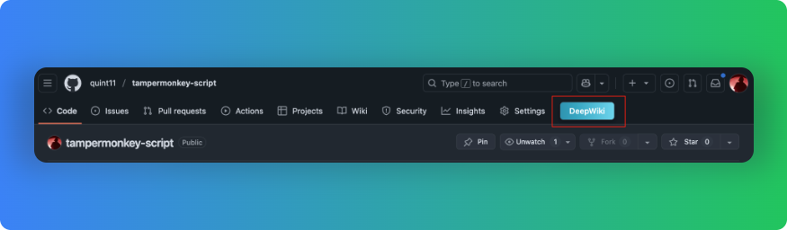

# 油猴脚本

## 脚本列表

脚本名字 | 作用 | 效果展示
---|---|---
[deepwiki](./deepwiki.js) | 在 GitHub 项目页添加 DeepWiki 跳转按钮，一键打开对应 DeepWiki 页面 | 

## deepwiki.js 说明

### 功能简介

- 在 GitHub 项目主页导航栏自动添加一个“DeepWiki”按钮。
- 点击按钮可直接跳转到对应项目的 DeepWiki 页面。
- 按钮采用蓝绿渐变色，支持悬停动画，界面美观。
- 自动适配新版和旧版 GitHub UI，支持 SPA 页面跳转。

### 使用方法

1. 安装 [Tampermonkey](https://www.tampermonkey.net/) 浏览器插件。
2. 新建脚本，将 [xxx.js](./deepwiki.js) 的内容粘贴进去并保存。
3. 访问指定网页，即可看到效果

### 效果截图

---
如需反馈或贡献，欢迎访问 [GitHub 仓库](https://github.com/quint11/tampermonkey-script.git)。